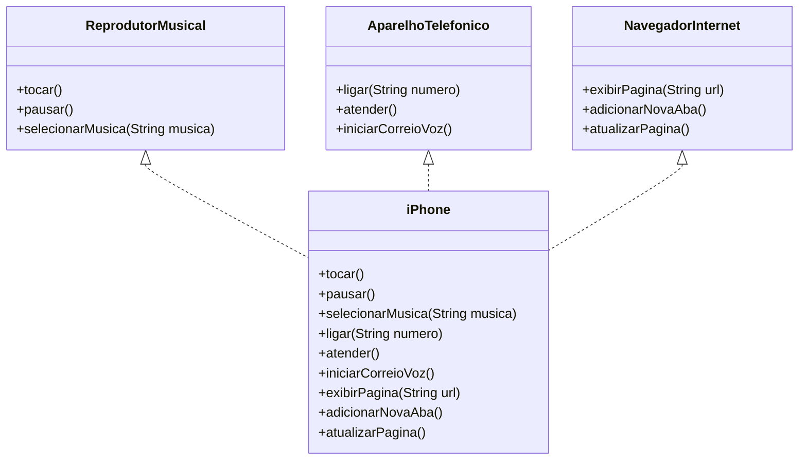

# Desafio POO iPhone - DIO

Este repositório contém a solução para o desafio de modelagem e diagramação UML do componente iPhone, abrangendo suas funcionalidades como Reprodutor Musical, Aparelho Telefônico e Navegador na Internet.

## Objetivo

Criar um diagrama UML que represente as funcionalidades do iPhone e implementar as classes e interfaces correspondentes em Java.

## Funcionalidades

### Reprodutor Musical
- `tocar()`
- `pausar()`
- `selecionarMusica(String musica)`

### Aparelho Telefônico
- `ligar(String numero)`
- `atender()`
- `iniciarCorreioVoz()`

### Navegador na Internet
- `exibirPagina(String url)`
- `adicionarNovaAba()`
- `atualizarPagina()`

## Estrutura do Projeto

- **AparelhoTelefonico.java**: Interface para funcionalidades de telefone.
- **ReprodutorMusical.java**: Interface para funcionalidades de reprodutor musical.
- **NavegadorInternet.java**: Interface para funcionalidades de navegador.
- **Iphone.java**: Implementação das interfaces acima.
- **diagrama.md**: Código do diagrama UML em sintaxe Mermaid.
- **diagrama-imagem.png**: Imagem do diagrama UML.

## Diagrama UML



## Como Executar
1. Clone o repositório:
```bash
git clone https://github.com/mariaclaramonteirop/desafio-iphone-uml.git
```
2. Navegue até o diretório do projeto:
```bash
cd desafio-iphone-uml
```
3. Compile e execute os arquivos Java conforme necessário.

## Contribuições
Contribuições são bem-vindas! Sinta-se à vontade para abrir issues ou enviar pull requests.

```bash Este README fornece uma visão geral clara do projeto, incluindo seu objetivo, funcionalidades, estrutura do projeto, diagrama UML e instruções sobre como executar o projeto.```
