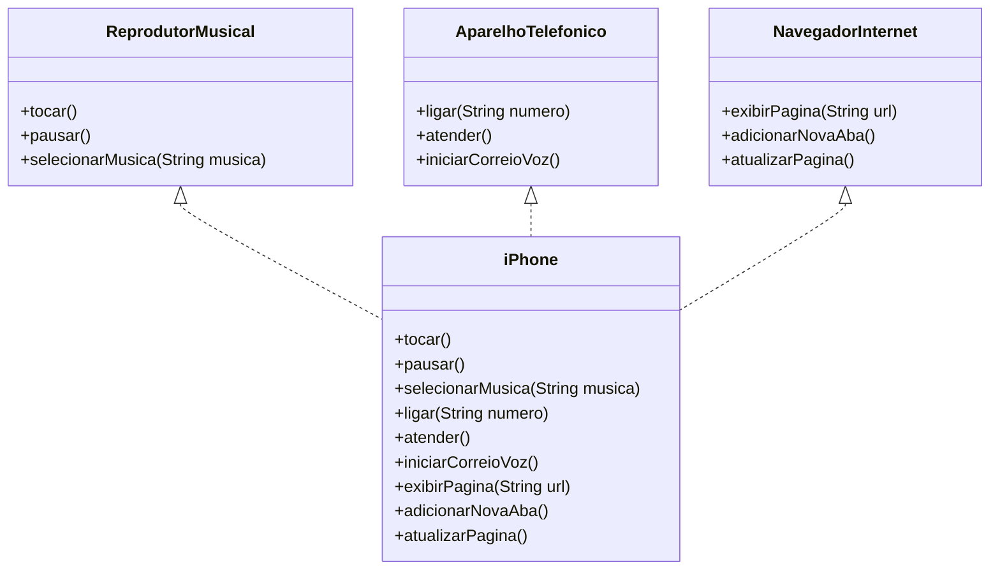

```mermaid

classDiagram
    class iPhone {
        +tocar()
        +pausar()
        +selecionarMusica(String musica)
        +ligar(String numero)
        +atender()
        +iniciarCorreioVoz()
        +exibirPagina(String url)
        +adicionarNovaAba()
        +atualizarPagina()
    }

    ReprodutorMusical <|.. iPhone
    ReprodutorMusical : +tocar()
    ReprodutorMusical : +pausar()
    ReprodutorMusical : +selecionarMusica(String musica)

    AparelhoTelefonico <|.. iPhone
    AparelhoTelefonico : +ligar(String numero)
    AparelhoTelefonico : +atender()
    AparelhoTelefonico : +iniciarCorreioVoz()

    NavegadorInternet <|.. iPhone
    NavegadorInternet : +exibirPagina(String url)
    NavegadorInternet : +adicionarNovaAba()
    NavegadorInternet : +atualizarPagina()
    
```